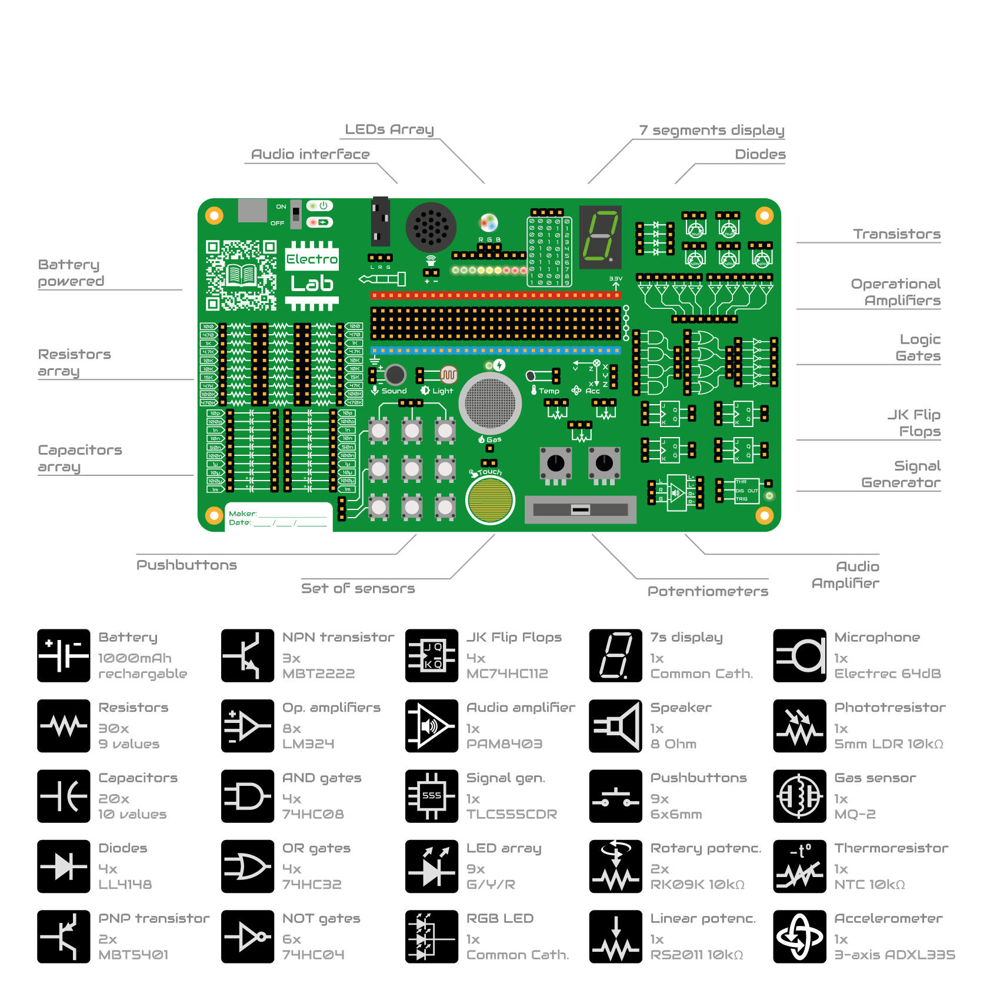

[![Documentation Status][documentation-shield]][documentation]
[![GitHub Release][releases-shield]][releases]
[![License][license-shield]](LICENSE)
[![BuyIt][buyit-shield]][elecrow]

[![Project Maintenance][maintenance-shield]][maintenance]
[![BuyMeCoffee][buymecoffee-shield]][buymecoffee]

# ElectroLab

The ElectroLab board is an electronic trainer designed for educational purposes. It should be considered as a beginner-friendly guided solution for learning practical electronics where no prior knowledge is required.

With its big set of integrated components, the ElectroLab offers a very powerful and versatile platform for building up your electronic circuits in very few steps.

   

[documentation-shield]: https://readthedocs.org/projects/electrolab/badge/?version=latest&style=for-the-badge
[documentation]: https://electrolab.readthedocs.io/en/v3/

[releases-shield]: https://img.shields.io/github/release/JGAguado/ElectroLab.svg?style=for-the-badge
[releases]: https://github.com/JGAguado/ElectroLab/releases

[license-shield]: https://img.shields.io/badge/License-CC%20BY--NC--SA%204.0-lightgrey.svg?style=for-the-badge

[maintenance-shield]: https://img.shields.io/badge/maintainer-J.%20G.%20Aguado-blue.svg?style=for-the-badge
[maintenance]: https://github.com/JGAguado

[buymecoffee-shield]: https://img.shields.io/badge/buy%20me%20a%20coffee-support-yellow.svg?style=for-the-badge
[buymecoffee]: https://www.buymeacoffee.com/J.G.Aguado

[buyit-shield]: https://img.shields.io/badge/get%20it%20on-elecrow-399BD7.svg?style=for-the-badge
[elecrow]: https://www.elecrow.com/electrolab.html