📱 Components
===========
The |Product| is a board that may look complex at first sight because of the density of components in the layout. However, once you get familiarized with the different parts, it's pretty simple and intuitive.

.. image:: images/components/General.png
    :width: 100%
    :align: center
    
Let's start by exploring the different sections that form the |Product|, how they work and what to do with them.

Power
-------------
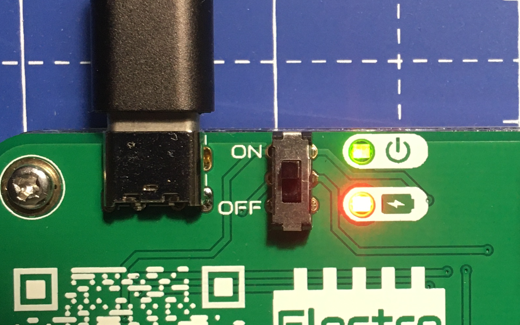

    Top side view

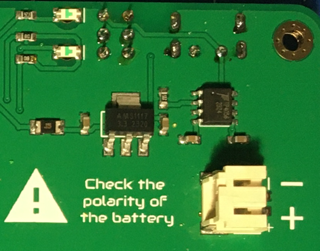

    Bottom side view    

The |Product| is powered internally at 3.3V (volts). Since the board is battery powered, the most convenient way (and therefore avoiding step-up converters) was to adapt the 
components to a 3.3V working range.

The internal circuit for charging the battery (which can be consulted on the :ref:`schematic <schematic>`) is ready to handle the nominal 5V from the USB-C port.

There is a resetable fuse and a voltage regulator (:term:`LDO`) after the battery, in order to prevent the rest of the electronic components to receive the 4.2V of the :term:`LiPo`

    
Once the board is powered, not only the Integrated Circuits (:term:`IC`) are being energized, but also the 3.3V bar gets its voltage with respect to the :term:`GND` bar. 
The only exception is the Gas sensor, that needs the 5V from the USB-C, and that will only work when the board is wired to a 5V source.

The 3.3V & :term:`GND` bar are separated by 4 rows of other pinheads. These headers are interconnected vertically, forming nodes of 4 points for those applications that requires multiple connections in one node.

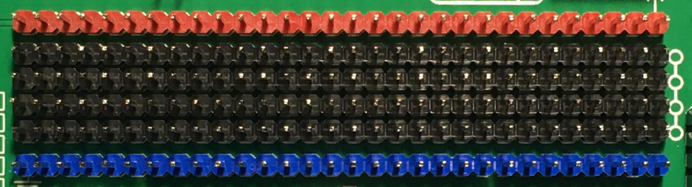
.. image:: images/components/BusBar_bottom.png
  :height: 120px
  :align: right

|
|
|
|
|
|

----------

Resistors
-------------

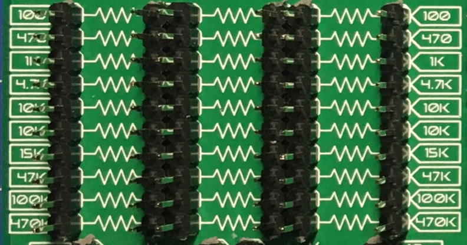

    Top side view

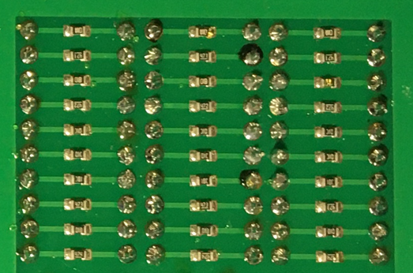

    Bottom side view

The resistors array, located in the left side of the |Product|, consist on three columns of 10 resistors per row, giving a total of 30 resistors. As experience has showed us, the value of 10kΩ is specially useful (for pull-down/pull-up circuits), and that is why there are two columns with the same value. Apart from this exception, the rest of rows has its own individual value.

As it can seen on the board's back, each resistor is connected to two male pinhead, so the access to each terminal of each resistor is clear.

The resistors have no *polarity*, meaning that any of the terminals can go to the positive or negative side of a circuit. 

Resistors values:

=====  =====  ======
100Ω   100Ω   100Ω
470Ω   470Ω   470Ω
1kΩ    1kΩ    1kΩ
4.7kΩ  4.7kΩ  4.7kΩ
10kΩ   10kΩ   10kΩ
10kΩ   10kΩ   10kΩ
15kΩ   15kΩ   15kΩ
47kΩ   47kΩ   47kΩ
100kΩ  100kΩ  100kΩ
470kΩ  470kΩ  470kΩ
=====  =====  ======

----------

Capacitors
--------------

.. figure:: images/components/Capacitors_top.png
    :align: left
    :figwidth: 150px

    Top side view

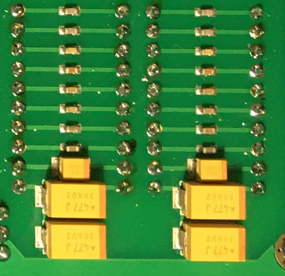

    Bottom side view

The capacitors array, located under the resistors array, consists on two columns of 10 capacitors each. In this case each row has its own value, giving a total of 20 capacitors, 10 different values.

The first 8 rows (or values) are formed by ceramic capacitors, that have no polarity. However, the last two rows (values 100 μF and 1mF) are tantalum capacitors, **with polarity**.

|
|

Capacitors values:

=====  ===== 
10pF   10pF   
100pF  100pF   
1nF    1nΩ    
10nF   10nF  
50nF   50nF   
100nF  100nF   
1μF    1μF
10μF   10μF   
100μF  100μF  
1mF    1mF
=====  =====  

.. Warning::
     It's important to pay attention how the polarized capacitors are connected in the circuit **before** powering it, making sure that the side with the **+** symbol **never** goes to the :term:`GND`. 

----------

Diodes
------------

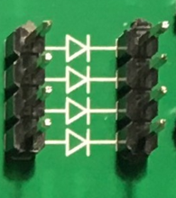

    Top side view

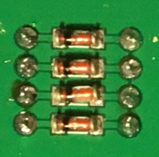

    Bottom side view

The |Product| comes with a 4 diodes set, in this case, located in the upper right side of the board, between the 7 segments display and the transistors.

|
|
|
|
|
|

----------

Transistors
--------------

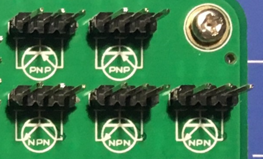

    Top side view

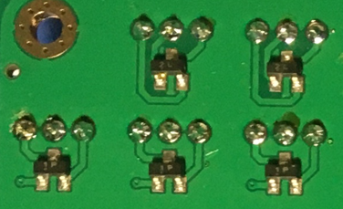

    Bottom side view

    
There are two types of transistors integrated in the |Product|: PNP & NPN. Both of them are placed on the top right side of the board. Due to the limited space on the board and the more extended use of the NPN, there is one more of this type: 3 NPN in total and 2 PNP type. 

Attending to the white printed silkscreen on the board, it is easy to identify each terminal of the transistor to be used on the circuit.

|
|

----------

Operational Amplifier
---------------------

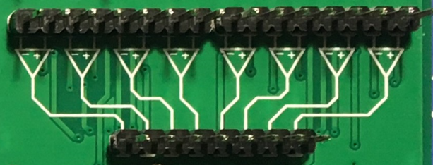

    Top side view

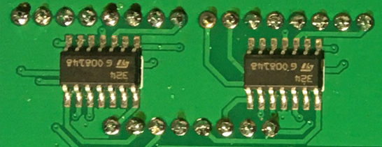

    Bottom side view

The :term:`Op.Amp.` :term:`IC` that the |Product| mounts is a LM2902DT. Each :term:`IC` contains up to 4 independent :term:`Op.Amp.`, giving a total of 8 for the |Product| board, located on the right side of the board.

As printed in the silkscreen, the inputs to the :term:`Op.Amp.` are placed on the upper side, while the outputs are under. With a little bit of zoom it can be appreciated in the silkscreen which input is the Inverting (-) and which one is the Non-Inverting (+)

As commented in the power section, these :term:`Op.Amp.` are powered as soon as the |Product| is powered, making them ready to be used.

|
|

----------

Logic gates
-----------

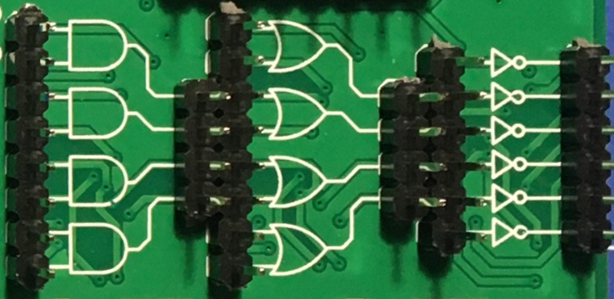

    Top side view

.. figure:: images/components/LogicGates_bottom.png
    :align: right
    :figwidth: 150px

    Bottom side view

Moving on to the 100% digital circuits, |Product| integrates a set of 3 different logic gates: 4 AND, 4 OR and 6 NOT. The set of gates are placed on the right side of the board, directly under the :term:`Op.Amp.` and divided by columns (according to the gate type).

Attending to each type of logic gate, the used :term:`IC` are the following:

- AND gates: SN74LV08ADR. 
- OR gates: SN74LV32ADR. 
- NOT gates: SN74LV04ADR. 

When working with 3.3V levels, the definition of a bit (1 or 0) is done by voltage levels. For avoiding the background electrical noise to interfere with our logic processes, all the logic gates inputs are pulled-down through a 10kΩ resistor array.

|
|

----------

Flip Flops
-----------

.. figure:: images/components/FlipFlops_top.png
    :align: left
    :figwidth: 150px

    Top side view

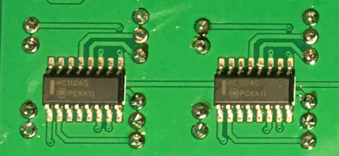

    Bottom side view

Continuing with the digital circuits, and located under the logic gates, the |Product| integrates 4 JK :term:`FF` thanks to two 4027D :term:`IC`. 

The :term:`FF` are, like in the case of the logic gates, ready to be used. 

|
|

----------

Signal generator
-----------------

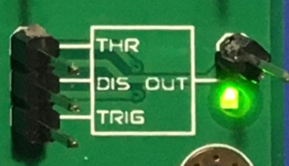

    Top side view

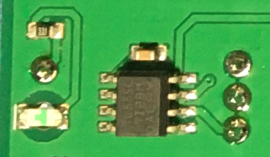

    Bottom side view

The |Product| integrates a square signal generator, the well-known **555** Timer oscillator :term:`IC`, placed on the bottom right side of the board.

This common :term:`IC` can provide square signals (0-3.3V) and depending on the assembled circuit the integrated 555 can be configured as monostable or astable multivibrator. This is because the pin 5 of the 555 :term:`IC` is internally connected to a 0.01μF capacitor, as it is required for any monostabe or astable configuration.

|
|

----------

Audio
----------------

.. WARNING:: 
    The speaker has polarity. When assembling this device, pay attention to the marks under the sensor.

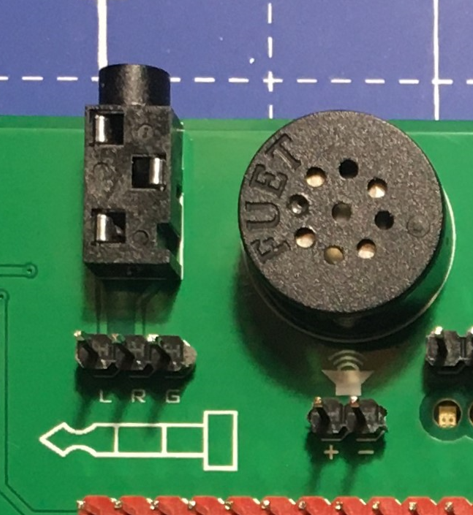

    Top side view

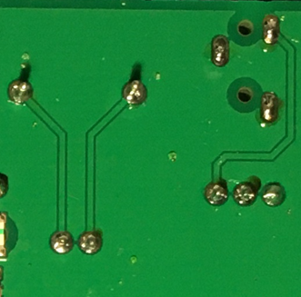

    Bottom side view

Next to the signal generator, also on the bottom right side of the board, there is a class-D audio amplifier based on the PAM8403 :term:`IC`.

This filter-less 3W stereo amplifier is internally prepared to provide a ready-to-use interface, it can input the left (L) and/or right (R) channels. It is important to connect correctly the :term:`GND` from the jack to the :term:`GND` of the amplifier.

|
|

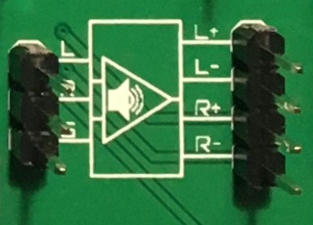

    Top side view

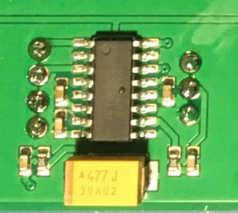

Bottom side view

As part of the audio laboratory there are two more components: 2 jack connectors and 1 speaker, located on the upper side of the |Product|.

|
|
|
|
----------

Opto-electronics
----------------
.. WARNING:: 
    The :term:`RGB` :term:`LED` has polarity. When assembling this device, pay attention to allign the plain side of the device 
    with the marks on the board.

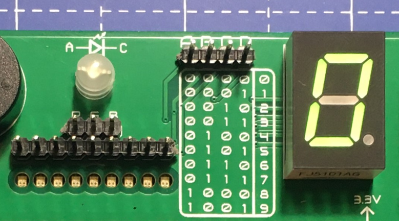

    Top side view

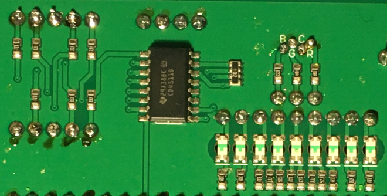

    Bottom side view

Next to the speaker, and continuing with the non-electric signals the |Product| can output, the opto-electronics section can be found: 3-colors :term:`LED` bar, :term:`RGB` & 7 segments display.

The light bar is just a set of 9 LEDs (with their correspondent resistance internally connected to the anode) pulled to the ground. This way, when a voltage is applied to each :term:`LED` pin, this will turn on, as simple as that. The bar has 3 different colors, green, yellow and red (from left to right), of 3 LEDs each color.

The :term:`RGB` :term:`LED` is an opto-electronic device that packs in a compact way 3 different LEDs of 3 different colors: red, green and blue (RGB). These 3 LEDs are connected by the cathode to the ground and each anode of them is already connected to the appropriate resistors, so the user can just input the voltage individually: you can replicate almost any color of the light spectrum.

The seven segments (7s) :term:`LED` display is the last, but not least, component of the section, located between the :term:`RGB` :term:`LED` and the diodes. The 7 segments display, name that receives because of the amount of *bars* that conform each digit of the display, is internally connected to a BCD decoder :term:`IC`: the CD4511.

This BCD to seven segment decoder has 4 input and 7 output lines. This output is given to the 7 segment display, through the required resistors, so it displays the decimal number depending on the inputs.

|
|

----------

Push-buttons
------------------

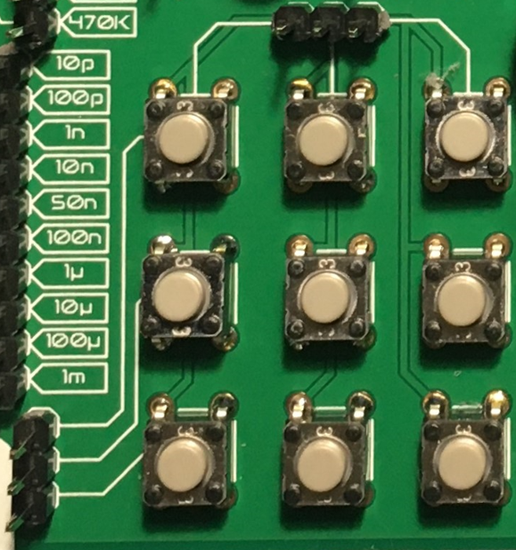

    Top side view

Moving to the board's inputs side, we can easily recognize the push-buttons array on the bottom area next to the capacitors.

Individually, a push-button connects the two terminals it has if it is pressed, like a switch, letting the current flow. 

On the assembled array, each of the push-buttons, if pressed, connects one of the upper pins with one of the lateral pins, depending on the column and the row.

|
|

----------

Potentiometers
----------------------

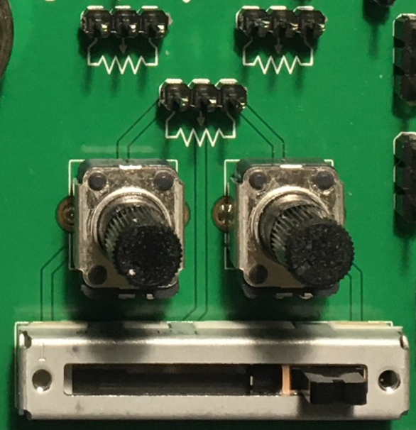

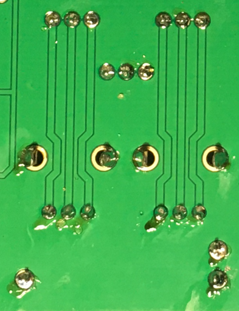

A potentiometer is a resistor whose values can be changed by a manual action. In the case of the |Product|, there are two different types of integrated potentiometers: 2 rotary and 1 linear, located on the bottom side, next to the audio amplifier circuit and the flip flops.

In both cases, the resistance range the mounted potentiometers is 0 to 10kΩ. The minimum values are reached, naturally, when the knob/slider, are in the left position, and the maximum when they are in the right position.

.. Warning::
    If you are assembling any circuit non-listed in the official tutorials of the |Product|, please make sure that there is some minimum resistance (>100Ω) in series with the used potentiometer. This is recommended because if the potentiometer is moved to the minimum resistance values, the current flowing through the potentiometer increases, which can damage irreversibly the component.
 
|
|

----------

Sensors
----------------

Despite two types of input components have already been presented, these cannot be considered as sensors. A sensor, or transducer, is a device that *converts* a physical parameter (such as acceleration, light or temperature) to a measurable electrical signal.

The area where the sensors are placed extends from the center of the board (under the :term:`GND` pinhead row) to the bottom edge, forming a "T".

Microphone
^^^^^^^^^^^^
.. WARNING:: 
    This device has polarity. When assembling this device, pay attention to the marks under the sensor.

.. figure:: images/components/Microphone_top.png
    :align: left
    :figwidth: 150px

    Top side view

The electrec microphone is placed on the left side of the sensor's area. The CMEJ-0627-42-P is an omnidirectional microphone with a -42dB sensitivity.

.. Warning::
    As the electrec microphone is a component with polarity, it's important to pay attention to the **+** and **-** printed signs on the silkscreen of the |Product|

|
|

----------

LDR
^^^^^^^^^^^^

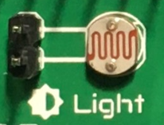

    Top side view

The :term:`LDR` is placed next to the microphone. The used component is the GL5528.

|
|
|
|
|

----------

Thermistor
^^^^^^^^^^^^

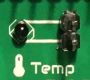

    Top side view

The thermistor component integrated in the |Product|, next to the :term:`LDR`, is a :term:`NTC` type. This means that the resistance decreases as temperature rises. 

|
|
|

----------

Accelerometer
^^^^^^^^^^^^

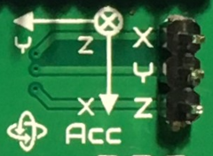

    Top side view

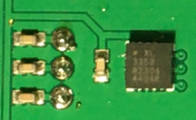

    Bottom side view

The |Product| integrates a tri-axial analog accelerometers, placed on the right side of the sensor's area. The chosen device is the ADXL337 transducer from Analog Devices, able to measure up to ±3g. 

As the accelerometer :term:`IC` works with 3V, a voltage regulator is connected internally to provide the required power to the :term:`IC`. The sensor outputs 3 signals, according to each axis, from 0 to 3V that corresponds to the range from -3g to +3g. This means that, for example, when the device's Z axis is vertical (aligned with the local gravity) the X and Y axis of the sensor should read 0g, providing an output signal of ~1.5V.

|
|

----------

Gas sensor
^^^^^^^^^^^^^^^^
.. Note::
    This sensor is the only one requiring 5VDC to work. Therefore it will only work when there is a USB powering the board. 
    You can verify this sensor is working through the :term:`LED` close to the sensor.

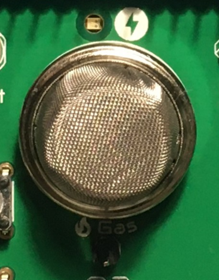

    Top side view

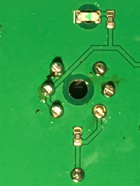

    Bottom side view

Despite you can mount any other MQ sensor series, the one by default is the MQ-2. This device is a :term:`MOS` sensor. Metal oxide sensors are also known as Chemiresistors because sensing is based on the change in resistance of the sensing material when exposed to gasses.

In the case of the MQ-2, the MOS reacts to LPG, Smoke, Alcohol, Propane, Hydrogen, Methane and Carbon Monoxide concentrations, ranging from 200 to 10000 :term:`ppm`.

|
|

.. hint:: 
    In the case of a sensor reading of 100 :term:`ppm` of CO it would mean that only 100 molecules (out of 1 million) present on the gas would be CO, and the other 999900 would be any other gas.

----------

Tactile sensor
^^^^^^^^^^^^^^^^
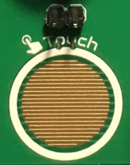

    Top side view

The *tactile* sensor is based on conductivity (or resistivity). It works by measuring the conductivity of any item in contact with the top's layer expoded pad. The sensor is formed by a 2 sets of horizontal lines interconnected vertically. If any conductive item (like a drop of water or a finger) is in contact with the layer, the resistance in between the two pins decreases.
