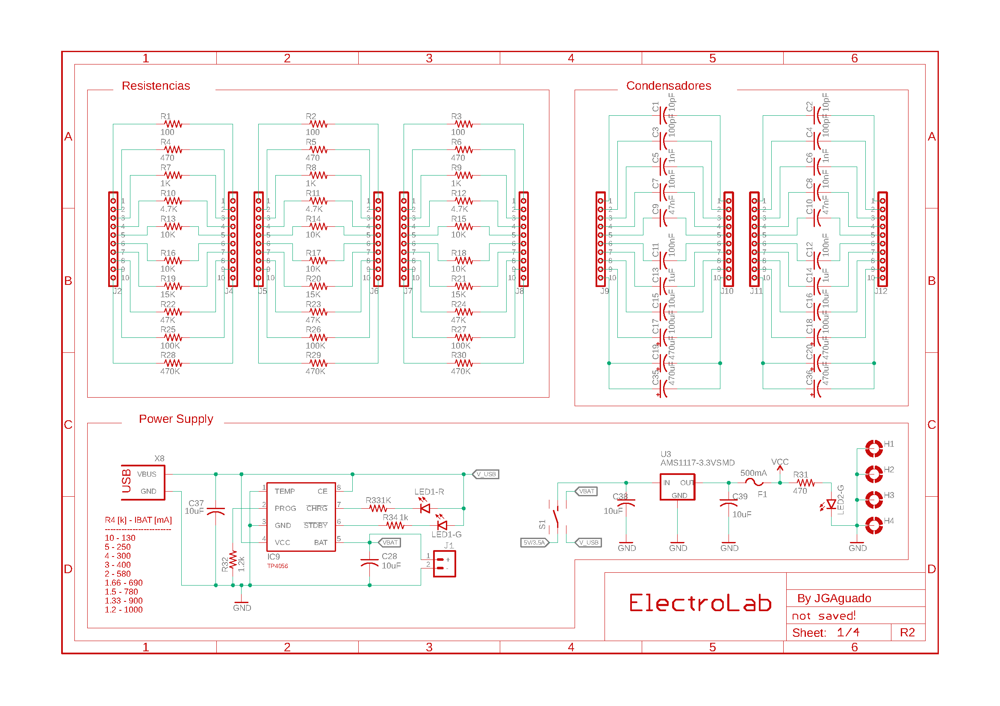
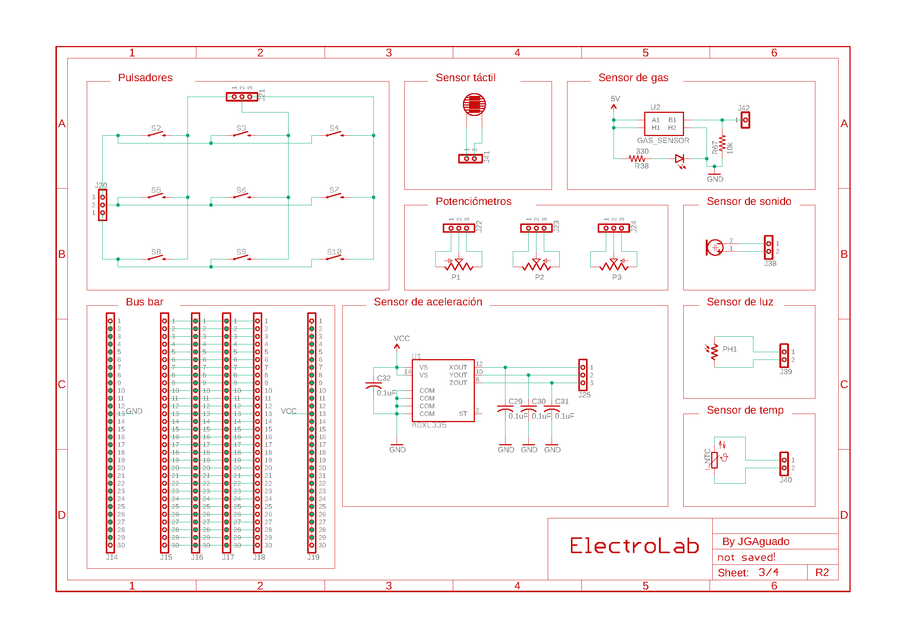

📐 Design
=======================

.. _schematic:
Electronic schematics
---------------------

.. image:: ../../../Documentation/Schematics/Schematic_4.png
    :width: 49%

:download:`Download PDF <../../../Documentation/Schematics/Schematic.pdf>`

.. _pcb:

:term:`PCB`
----------

.. raw:: html

    <iframe src="_static/ibom.html" height="800px" width="100%"></iframe>

Technical Specifications
--------------------------

Electrical
^^^^^^^^^^^^

.. list-table:: 
    :widths: 50 20 20 20 20
    :header-rows: 1
    :stub-columns: 1

    * - Parameter
      - Symbol
      - Min.
      - Max.
      - Unit
    * - Supply voltage (USB)
      - :math:`V_{DC}`
      -  
      - 5
      - *V*
    * - Current consumption
      - 
      - 0.5 
      - 800
      - :math:`mA`

Environment
^^^^^^^^^^^^
.. list-table:: 
    :widths: 50 20 20 20 20 20
    :header-rows: 1
    :stub-columns: 1

    * - Parameter
      - Symbol
      - Min.
      - Typ.
      - Max.
      - Unit
    * - Working temperature [1]_
      - :math:`T_{amb}`
      - 0
      - 25 
      - 60
      - *°C*
    * - Storage temperature [1]_
      - :math:`T_{amb}`
      - 0
      - 25 
      - 60
      - *°C*

.. [1] Based on components datasheets.