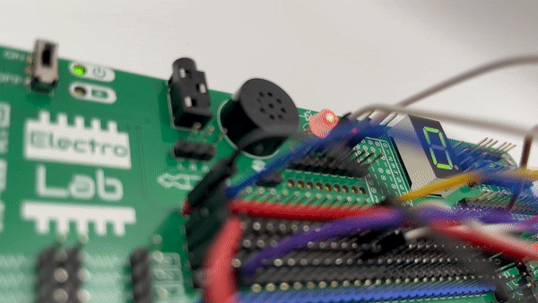

💡 Getting started
===============

    Oscillating circuit

The ElectroLab board is being sold as a kit, which means that you will need to assemble (and solder) it. The first thing to do once you 
receive your kit, is making sure you find all the components included:

1. ElectroLab board (green PCB)
2. Stencil board (purple PCB)
3. Female-to-female jumper boards (pack of 40)
4. THT components:

    - 2x Rotary potentiometers
    - 1x Linear potentiometer
    - 1x Speaker
    - 1x 7 segments display
    - 1x RGB led
    - 1x Slide switch
    - 1x USB-C connector
    - 1x NTC thermistor
    - 1x LDR photoresistor
    - 1x Microphone
    - 9x Pushbutton
    - 1x 3.5mm jack connector
    - 1x MQ-2 gas sensor
    - 1x Blue header
    - 1x Red header
    - 10x Black header

and optionally you could have acquired:

- A 1000mAh LiPo battery
- A protection enclosure consisting on:

    - 3 transparent acrylic plates
    - 4 screws set (screw, washer & nut)

After assembling it (visit the :doc:`assembly` section), you will be able to make your own circuits 
or start exploring the ones on the :doc:`examples` section.

🎓How it works?
-------------
On the |Product|, each component is internally powered and it's :term:`I/O` are already routed to an accessible pinhead. 
This makes it very easy the quick prototyping of electronic circuits since you just need to interconnect them with female-female wires.

While working with the |Product|, make sure you follow this steps:

- ✅ Analyze and understand the schematic you want to assembly with the |Product|

- ✅ Check if you will be using polarized components (like the polarized capacitors or the microphone) for paying extra attention.

- ✅ Before plugging or unplugging any jumper wires, make sure the board is turned off:

- ✅ Assembly the circuit following a known order, it will save you time in case you get lost.

- ✅ Check that there are not any wire connecting 3.3V to :term:`GND`.

- ✅ Connect the USB cable or the Auxiliar Interface in order to power the board.

- ✅ Toggle the switch and check that the power led turns on.

- ✅ Play with your recently assembled circuit and experiment with safety!

.. Caution::
    If the Power LED indicator doesn't turn on, power off the board and check the circuit: you might have 
    a shortcircuit somewhere!

