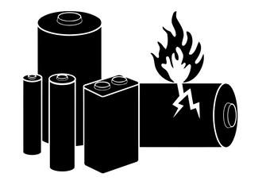
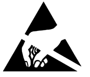

🦺 Safety guidelines
=================

These safety guidelines, the operation instructions and the limit values listed in :doc:`specs` are to be read carefully before operating the product.

.. Caution::
    This product has been designed for educational applications. 
    It was not designed for any use involving serious risks or hazards that could lead to death, injury, serious physical damage, or loss of any kind without the implementation of exceptionally stringent safety precautions.

Before the operation
--------------------
Before working with the |Product|, make sure to meet all of the following criteria:

- The |Product| is placed in a stable non-conductive surface.
- There are no objects or debris stuck in between the male pins of the surface of the board.
- Do not manipulate the board if you have wet hands or in such conditions that could lead to a short-circuit.
- Do not manipulate the board if you feel that you are electrostatically charged.
- Some components have polarity, meaning that they need a specific way of being connected.Please pay attention to the (⚠️) indications in this document related to those components.

 
:term:`LiPo` battery powered
----------------------

Due to the high power density of :term:`LiPo` batteries, the |Product| is powered directly by a 1000mAh :term:`LiPo` battery. Therefore there are specific electronics embeded in charge of the battery 
management, including charge/discharge of the battery and protections against low-voltage levels and short-circuits. 

However it's not recommended to leave the product unatended while charging for long time. In case you observe a high increase of the device's temperature or you 
smell burn, immediatelly disconnect the device from the charging USB.

If you have any question, please check with :ref:`technical support <support>` before taking any action potentially dangerous.

Protection against :term:`ESD`
------------------------------

The |Product| contains components sensitive to :term:`ESD`, which can be damaged by inappropriate handling. 
It's therefore necessary to provide some safety precautions against :term:`ESD` during the handling and operation.

|
|

Usage, transport and storage
----------------------------

During the use, transport and storage, this product must be protected from any mechanical stress 
(forces applied over the board or it's components), temperatures out of the data-sheet's range, high 
environmental humidity or aggressive atmospheres.

Avoid using it in areas where it cannot be assured the previously mentioned environmental conditions.

Repairs
-------

If any of the components on the board gets damaged, a reparation is possible. This repair can be performed by 
yourself if you identify the problem and have the means for desoldering & soldering. If this is not the case,
just write to the :ref:`support <support>` mail to reach a solution.

Disposal
--------

    
In accordance with national and local environmental protection and material recovery and recycling regulations, 
electronic devices that can no longer be used (in case a repair is not possible) must be disposed of separately 
and not with normal household garbage.

|
|
|
|

Restriction of Hazardous Substances
-----------------------------------

The :term:`PCB` and the electronic components mounted on the |Product| have been manufactured attending to the EU rules 
restricting the use of hazardous substances (:term:`RoHS`) in electrical and electronic equipment to protect the 
environment and public health. 

