📱 Componentes
=============

La |Product| es una placa que puede parecer compleja a primera vista debido a la densidad de componentes en el diseño. Sin embargo, una vez que te familiarizas con las diferentes partes, es bastante simple e intuitivo.

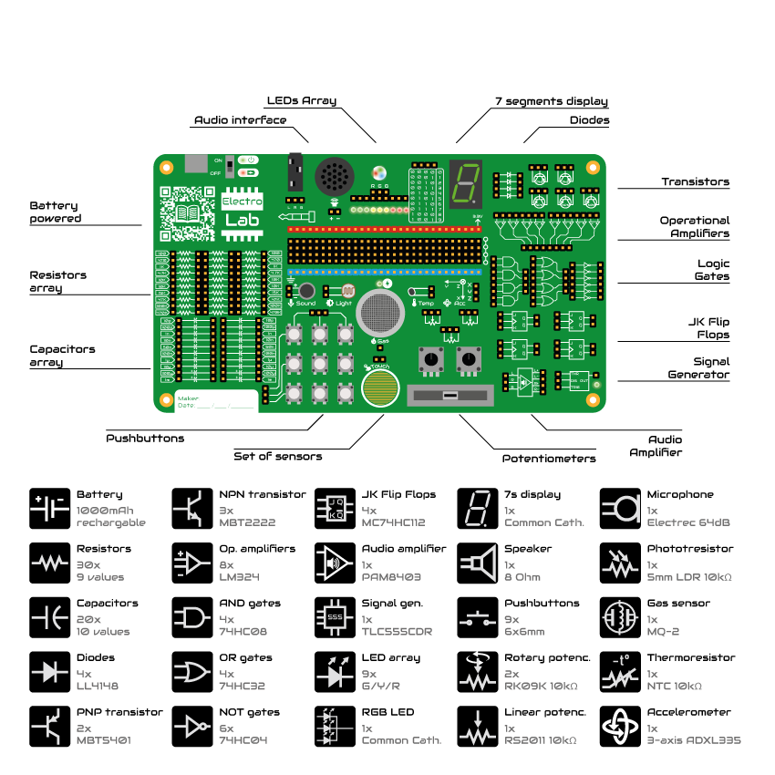
    
Comencemos explorando las diferentes secciones que conforman la |Product|, cómo funcionan y qué hacer con ellas.

Alimentación
-------------
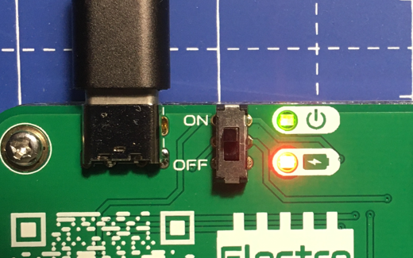

    Vista superior

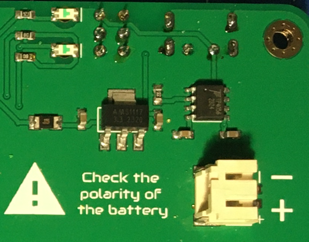

    Vista inferior    

La |Product| se alimenta internamente a 3.3V (voltios). Dado que la placa funciona con batería, la forma más conveniente (y evitando conversores dc-dc) fue adaptar los 
componentes a un rango de trabajo de 3.3V.

El circuito interno para cargar la batería (que se puede consultar en el :ref:`esquema <schematic>`) está preparado para manejar los 5V nominales del puerto USB-C.

Hay un fusible rearmable y un regulador de voltaje (:term:`LDO`) después de la batería, para evitar que el resto de los componentes electrónicos reciban los 4.2V de la :term:`LiPo`.

Una vez que la placa está alimentada, no solo se energizan los Circuitos Integrados (:term:`IC`), sino que también la barra de 3.3V recibe su voltaje con respecto a la barra de :term:`GND`. La única excepción es el sensor de gas, que necesita los 5V del USB-C y solo funcionará cuando la placa esté conectada a una fuente de 5V.

La barra de 3.3V y :term:`GND` están separadas por 4 filas de otras cabeceras de clavijas. Estas cabeceras están interconectadas verticalmente, formando nodos de 4 puntos para aquellas aplicaciones que requieren múltiples conexiones en un nodo.

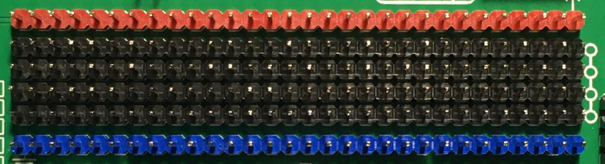
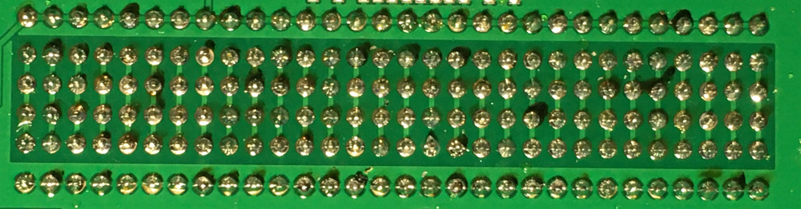

|
|
|
|
|
|

----------

Resistencias
-------------

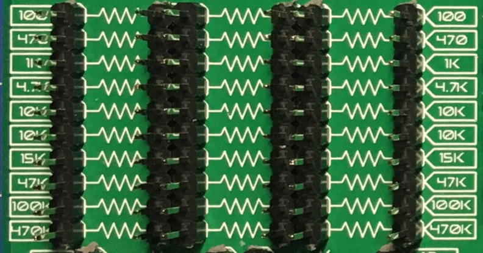

    Vista superior

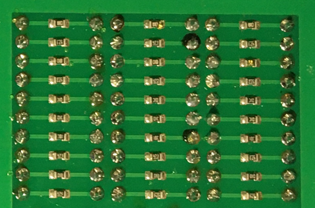

    Vista inferior

El conjunto de resistencias, ubicado en el lado izquierdo de la |Product|, consiste en tres columnas de 10 resistencias por fila, dando un total de 30 resistencias. Como nos ha mostrado la experiencia, el valor de 10kΩ es especialmente útil (para circuitos pull-down/pull-up), por eso hay dos columnas con el mismo valor. Aparte de esta excepción, el resto de las filas tiene su propio valor individual.

Como se puede ver en la parte posterior de la placa, cada resistencia está conectada a dos cabezas de clavija macho, por lo que el acceso a cada terminal de cada resistencia es claro.

Las resistencias no tienen *polaridad*, lo que significa que cualquiera de los terminales puede ir al lado positivo o negativo de un circuito. 

Valores de resistencias:

=====  =====  ======
100Ω   100Ω   100Ω
470Ω   470Ω   470Ω
1kΩ    1kΩ    1kΩ
4.7kΩ  4.7kΩ  4.7kΩ
10kΩ   10kΩ   10kΩ
10kΩ   10kΩ   10kΩ
15kΩ   15kΩ   15kΩ
47kΩ   47kΩ   47kΩ
100kΩ  100kΩ  100kΩ
470kΩ  470kΩ  470kΩ
=====  =====  ======

----------

Condensadores 
--------------

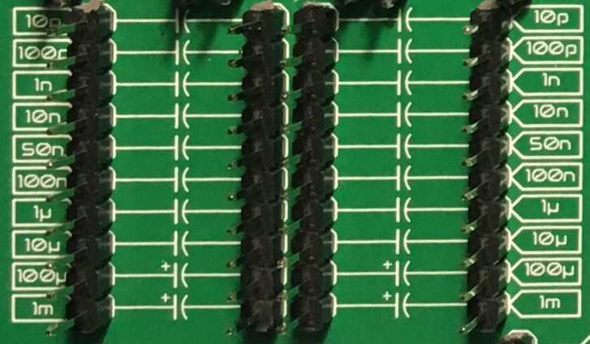

    Vista superior

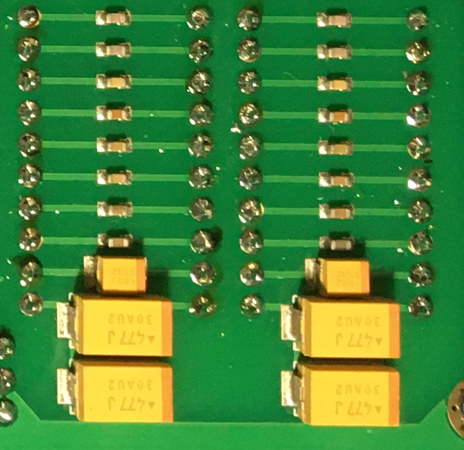

    Vista inferior

El conjunto de condensadores, ubicado debajo del conjunto de resistencias, consta de dos columnas de 10 condensadores cada uno. En este caso, cada fila tiene su propio valor, dando un total de 20 condensadores, 10 valores diferentes.

Las primeras 8 filas (o valores) están formadas por condensadores cerámicos, que no tienen polaridad. Sin embargo, las dos últimas filas (valores de 100 μF y 1mF) son condensadores de tantalio, **con polaridad**.

|
|
Valores de condensadores:

=====  ===== 
10pF   10pF   
100pF  100pF   
1nF    1nΩ    
10nF   10nF  
50nF   50nF   
100nF  100nF   
1μF    1μF
10μF   10μF   
100μF  100μF  
1mF    1mF
=====  =====  

.. Caution::
     Es importante prestar atención a cómo se conectan los condensadores polarizados en el circuito **antes** de alimentarlo, asegurándose de que el lado con el símbolo **+** **nunca** vaya al :term:`GND`. 

----------

Diodos
------------

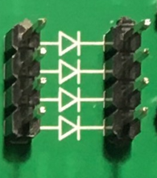

    Vista superior

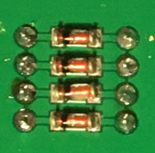

    Vista inferior

La |Product| viene con un conjunto de 4 diodos, en este caso, ubicados en el lado superior derecho de la placa, entre la pantalla de 7 segmentos y los transistores.

|
|
|
|
|
|

----------

Transistores
--------------

.. figure:: images/components/Transistors_top.png
    :align: left
    :figwidth: 150px

    Vista superior

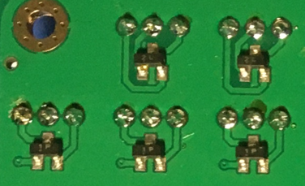

    Vista inferior

    
Hay dos tipos de transistores integrados en la |Product| : PNP y NPN. Ambos están ubicados en el lado superior derecho de la placa. Debido al espacio limitado en la placa y al uso más extendido del NPN, hay uno más de este tipo: 3 NPN en total y 2 de tipo PNP. 

Atendiendo a la serigrafía blanca impresa en la placa, es fácil identificar cada terminal del transistor a utilizar en el circuito.

|
|

----------

Amplificador operacional
---------------------

.. figure:: images/components/OpAmps_top.png
    :align: left
    :figwidth: 150px

    Vista superior

.. figure:: images/components/OpAmps_bottom.png
    :align: right
    :figwidth: 150px

    Vista inferior

El :term:`Op.Amp.` :term:`IC` que monta la |Product| es un LM2902DT. Cada :term:`IC` contiene hasta 4 :term:`Op.Amp.` independientes, dando un total de 8 para la placa de la |Product|, ubicados en el lado derecho de la placa.

Como se muestra en la serigrafía, las entradas al :term:`Op.Amp.` están colocadas en la parte superior, mientras que las salidas están debajo. Con un poco de zoom se puede apreciar en la serigrafía cuál entrada es la Inversora (-) y cuál es la No Inversora (+).

Como se comentó en la sección de alimentación, estos :term:`Op.Amp.` se alimentan tan pronto como se alimenta la |Product|, haciéndolos listos para ser utilizados.

|
|

----------

Puertas lógicas
-----------

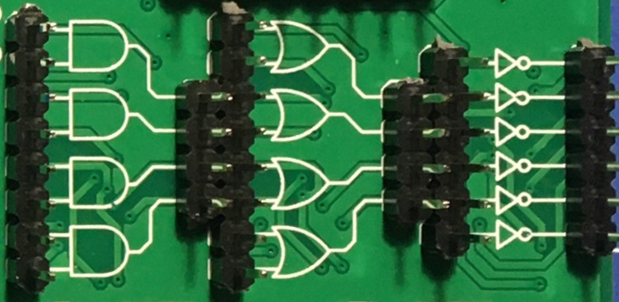

    Vista superior

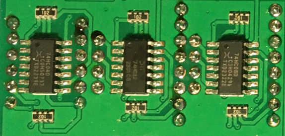

    Vista inferior

Pasando a los circuitos 100% digitales, la |Product| integra un conjunto de 3 compuertas lógicas diferentes: 4 AND, 4 OR y 6 NOT. El conjunto de compuertas está ubicado en el lado derecho de la placa, directamente debajo de los :term:`Op.Amp.` y dividido por columnas (según el tipo de compuerta).

Atendiendo a cada tipo de compuerta lógica, los :term:`IC` utilizados son los siguientes:

- Compuertas AND: SN74LV08ADR.
- Compuertas OR: SN74LV32ADR.
- Compuertas NOT: SN74LV04ADR.

Cuando se trabaja con niveles de 3.3V, la definición de un bit (1 o 0) se realiza mediante niveles de voltaje. Para evitar que el ruido eléctrico de fondo interfiera con nuestros procesos lógicos, todas las entradas de las compuertas lógicas se conectan a tierra a través de una matriz de resistencias de 10kΩ.

|
|

----------

Flip Flops
-----------

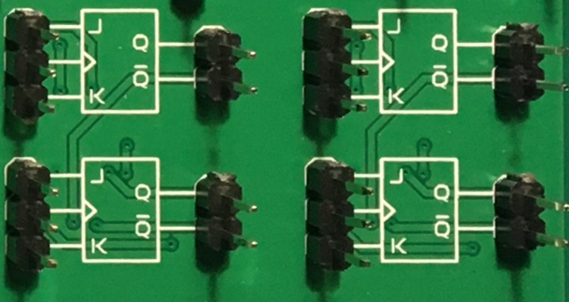

    Vista superior

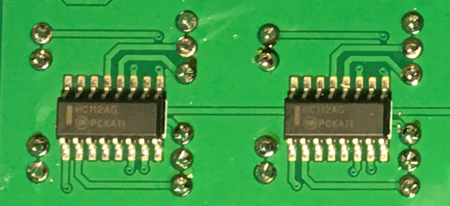

    Vista inferior

Continuando con los circuitos digitales, y ubicado debajo de las compuertas lógicas, la |Product| integra 4 JK :term:`FF` gracias a dos :term:`IC` 4027D :term:`FF`. 

Los :term:`FF` son, al igual que en el caso de las compuertas lógicas, listos para ser utilizados.

|
|

----------

Generador de señales
-----------------

.. figure:: images/components/555_top.png
    :align: left
    :figwidth: 150px

    Vista superior

.. figure:: images/components/555_bottom.png
    :align: right
    :figwidth: 150px

    Vista inferior

La |Product| integra un generador de señal cuadrada, el conocido **555** Temporizador oscilador :term:`IC`, ubicado en la parte inferior derecha de la placa.

Este común :term:`IC` puede proporcionar señales cuadradas (0-3.3V) y dependiendo del circuito ensamblado, el 555 integrado se puede configurar como monoestable o multivibrador astable. Esto se debe a que el pin 5 del 555 :term:`IC` está internamente conectado a un condensador de 0.01μF, como se requiere para cualquier configuración monoestable o astable.

|
| 
Audio
----------------

.. Warning:: 
    El altavoz tiene polaridad. Al ensamblar este dispositivo, presta atención a las marcas debajo del sensor.

.. figure:: images/components/Audio_top.png
    :align: left
    :figwidth: 150px

    Vista superior

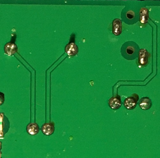

    Vista inferior

Junto al generador de señales, también en la parte inferior derecha de la placa, hay un amplificador de audio de clase D basado en el :term:`IC` PAM8403.

Este amplificador estéreo de 3W sin filtro está preparado internamente para proporcionar una interfaz lista para usar, puede recibir los canales izquierdo (L) y/o derecho (R). Es importante conectar correctamente el :term:`GND` del conector al :term:`GND` del amplificador.

|
|

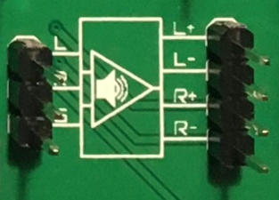

    Vista superior

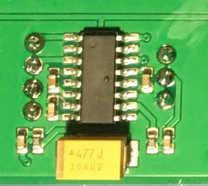

    Vista inferior

Como parte del laboratorio de audio, hay dos componentes más: 2 conectores jack y 1 altavoz, ubicados en la parte superior de la |Product| .

|
|
|
|
----------

Optoelectrónica
----------------
.. Warning:: 
    El :term:`LED` :term:`RGB` tiene polaridad. Al ensamblar este dispositivo, asegúrate de alinear el lado plano del dispositivo con las marcas en la placa.

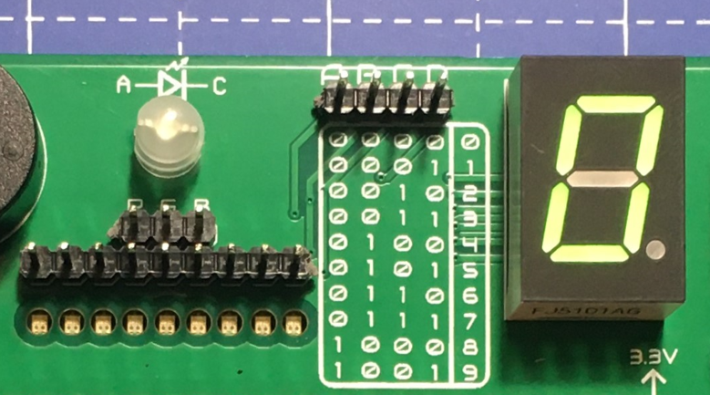

    Vista superior

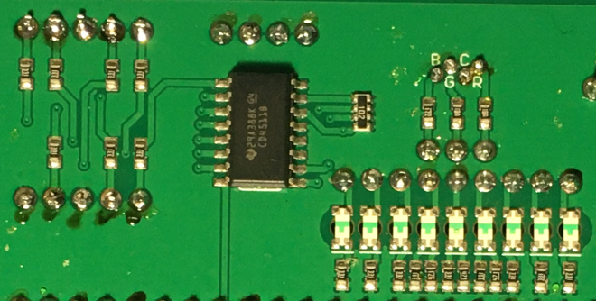

    Vista inferior

Junto al altavoz, y continuando con las señales no eléctricas que puede emitir la |Product|, se encuentra la sección de optoelectrónica: una barra de :term:`LED` de 3 colores, un :term:`LED` :term:`RGB` y una pantalla de 7 segmentos.

La barra de luces es simplemente un conjunto de 9 :term:`LEDs` (con su resistencia correspondiente conectada internamente al ánodo) conectados a tierra. De esta manera, cuando se aplica un voltaje a cada pin del :term:`LED`, este se encenderá, tan simple como eso. La barra tiene 3 colores diferentes, verde, amarillo y rojo (de izquierda a derecha), de 3 :term:`LEDs` cada color.

El :term:`LED` :term:`RGB` es un dispositivo optoelectrónico que incluye de manera compacta 3 :term:`LEDs` diferentes de 3 colores diferentes: rojo, verde y azul (RGB). Estos 3 :term:`LEDs` están conectados por el cátodo a tierra y cada ánodo está conectado a las resistencias apropiadas, por lo que el usuario puede simplemente ingresar el voltaje individualmente: se puede replicar casi cualquier color del espectro de luz.

La pantalla de siete segmentos (7s) es el último, pero no menos importante, componente de la sección, ubicado entre el :term:`LED` :term:`RGB` y los diodos. La pantalla de 7 segmentos, nombre que recibe debido a la cantidad de *barras* que conforman cada dígito del display, está conectada internamente a un decodificador BCD :term:`IC`: el CD4511.

Este decodificador BCD a siete segmentos tiene 4 líneas de entrada y 7 líneas de salida. Esta salida se proporciona a la pantalla de 7 segmentos, a través de las resistencias requeridas, para que muestre el número decimal dependiendo de las entradas.

|
|

----------

Pulsadores
------------------

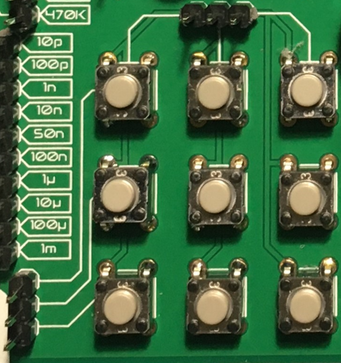

    Vista superior

Moviéndonos hacia el lado de las entradas de la placa, se pueden reconocer fácilmente los botones pulsadores en la zona inferior, junto a los condensadores.

Individualmente, un botón pulsador conecta los dos terminales que tiene si se presiona, como un interruptor, permitiendo el flujo de corriente.

En el conjunto ensamblado, cada uno de los botones pulsadores, al presionarse, conecta uno de los pines superiores con uno de los laterales, según la columna y la fila.

|
|

----------

Potenciómetros
----------------------

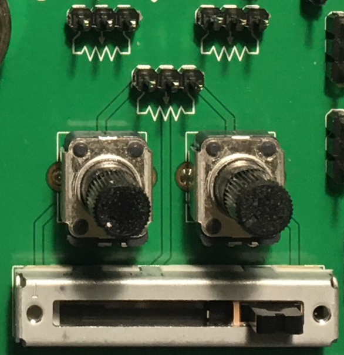

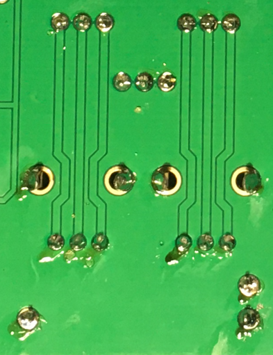

Un potenciómetro es una resistencia cuyos valores pueden cambiarse mediante una acción manual. En el caso de la |Product|, hay dos tipos diferentes de potenciómetros integrados: 2 rotativos y 1 lineal, ubicados en el lado inferior, junto al circuito amplificador de audio y los flip-flops.

En ambos casos, el rango de resistencia de los potenciómetros montados es de 0 a 10kΩ. Los valores mínimos se alcanzan naturalmente cuando el botón/deslizador está en la posición izquierda, y el máximo cuando están en la posición derecha.

.. Caution::
    Si estás ensamblando algún circuito no incluido en los tutoriales oficiales de la |Product|, asegúrate de que haya alguna resistencia mínima (>100Ω) en serie con el potenciómetro utilizado. Esto se recomienda porque si el potenciómetro se mueve a los valores mínimos de resistencia, la corriente que fluye a través del potenciómetro aumenta, lo que puede dañar irreversiblemente el componente.

|
|

----------

Sensores
----------------

A pesar de que ya se han presentado dos tipos de componentes de entrada, estos no pueden considerarse como sensores. Un sensor, o transductor, es un dispositivo que *convierte* un parámetro físico (como aceleración, luz o temperatura) en una señal eléctrica mensurable.

El área donde se encuentran los sensores se extiende desde el centro de la placa (debajo de la fila de pines :term:`GND`) hasta el borde inferior, formando una "T".

Micrófono
^^^^^^^^^^^^
.. Warning:: 
    Este dispositivo tiene polaridad. Al ensamblar este dispositivo, presta atención a las marcas en la placa.

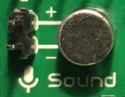

    Vista superior

La |Product| incluye un pequeño micrófono que convierte señales de sonido en señales eléctricas. Este micrófono, ubicado en la parte inferior central de la placa, está diseñado para capturar sonido y convertirlo en señales eléctricas, que luego pueden ser procesadas y utilizadas por otros componentes de la |Product| .

Sensor de luz
^^^^^^^^^^^^^^
.. Warning:: 
    Este dispositivo es sensible a la luz y puede variar su comportamiento según la intensidad lumínica.

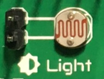

    Vista superior

La |Product| también integra un sensor de luz, conocido como un LDR (Light Dependent Resistor). Este sensor varía su resistencia dependiendo de la cantidad de luz que recibe. Ubicado junto al micrófono, en la parte inferior central de la placa, el LDR puede utilizarse para medir la intensidad de la luz en su entorno.

|
|

Termistor
^^^^^^^^^^^^^^^^^^^^^

.. figure:: images/components/NTC_top.png
    :align: left
    :figwidth: 150px

    Vista superior

El termistor integrado en la |Product|, junto al LDR, es de tipo :term:`NTC` (Coeficiente de Temperatura Negativo). Esto significa que la resistencia disminuye a medida que aumenta la temperatura. 

Acelerómetro
^^^^^^^^^^^^^^^^^^^^^^^^^^^^^

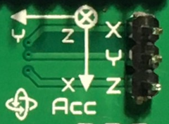

    Vista superior

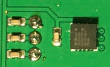

    Vista inferior

La |Product| integra un acelerómetro analógico triaxial, ubicado en el lado derecho del área de sensores. El dispositivo elegido es el transductor ADXL337 de Analog Devices, capaz de medir hasta ±3g.

El :term:`IC` del acelerómetro funciona con 3V, un regulador de voltaje está conectado internamente para proporcionar la potencia requerida al :term:`IC`. El sensor emite 3 señales, una para cada eje, desde 0 hasta 3V que corresponden al rango de -3g a +3g. Esto significa que, por ejemplo, cuando el eje Z del dispositivo está vertical (alineado con la gravedad local), los ejes X e Y del sensor deben leer 0g, proporcionando una señal de salida de ~1.5V.

|
|

Sensor de gas
^^^^^^^^^^^^^^^^^^^^^^^^^^

.. Note::
    Este sensor es el único que requiere 5VDC para funcionar. Por lo tanto, solo funcionará cuando haya una fuente de alimentación USB conectada a la placa. 
    Puedes verificar que el sensor está funcionando a través del :term:`LED` cercano al sensor.

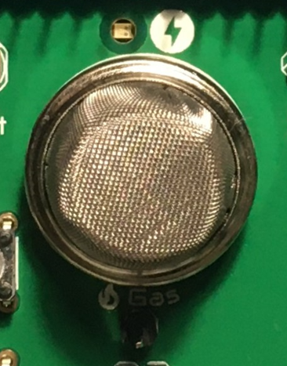

    Vista superior

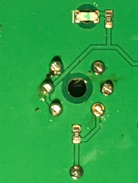

    Vista inferior

A pesar de que se pueden montar otros sensores de la serie MQ, por defecto se incluye el MQ-2. Este dispositivo es un sensor :term:`MOS`. Los sensores de óxido de metal también son conocidos como quimioresistores porque la detección se basa en el cambio de resistencia del material sensor cuando se expone a gases.

En el caso del MQ-2, el :term:`MOS` reacciona a concentraciones de GLP, humo, alcohol, propano, hidrógeno, metano y monóxido de carbono, en un rango de 200 a 10000 :term:`ppm`.

|
|

.. hint:: 
    En el caso de una lectura del sensor de 100 :term:`ppm` de CO, significaría que solo hay 100 moléculas (de 1 millón) presentes en el gas que son CO, y las otras 999900 serían de cualquier otro gas.

----------

Sensor táctil
^^^^^^^^^^^^^^^^^^^^^^^^^^^^^

.. figure:: images/components/Tactile_top.png
    :align: left
    :figwidth: 150px

    Vista superior

El sensor *táctil* se basa en la conductividad (o resistividad). Funciona midiendo la conductividad de cualquier objeto en contacto con la capa superior del sensor. El sensor está formado por 2 conjuntos de líneas horizontales interconectadas verticalmente. Si algún objeto conductor (como una gota de agua o un dedo) está en contacto con la capa, la resistencia entre los dos pines disminuye.

